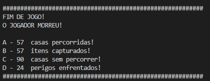

# Jogo_Labirinto

>Status: Finalizado

## Problema Proposto
Fazer um algoritmo que simule um Jogador que caminha por caminhos dentro de **K** matrizes de tamanho **NxN**, essas que por sua vez contem itens (**números inteiros**) coletáveis, paredes (**#**) e perigos (*) que removem pontos de vida do jogador.

## Objetivo
Conseguir fazer o Jogador caminhar randomicamente, coletando os itens até que acabem seus pontos de vida ou o caminho percorrido não tenha mais itens.

## Inicialização:
O programa começa com uma matriz sendo gerada pelo código: 
***https://github.com/mpiress/GenerateDataToMaze*** que sempre irá criar um arquivo de nome ***input.data***, podendo alterar o tamanho das linhas e colunas da matriz (**N**) e da quantidade de matrizes (**K**), usando as regras descritas na seção **"Problema Proposto"**.

## Lógica:
O Jogador inicia o jogo com pontuação máxima de vida (**10**) sempre na Matriz 0, em uma casa randomica que não seja parede. 
*Caso inicie o jogo em um perigo o jogador não sofre dano.

A forma de caminhar pela matriz é randomica:
### **Caso 1** 
+ #### Portal:

  

Sempre que o Jogador estiver em uma das bordas (em roxo na imagem) usará um portal na próxima jogada, fazendo com que entre em uma posição aleatória da próxima matriz, desde que não seja uma parede. 
*Um portal independente de qual borda estiver só pode colocar o jogador na matriz seguinte, e se for a ultima matriz, o jogador retornará a primeira.

### **Caso 2** 
+ #### Caminhando dentro da mesma matriz:

  

Nesse caso o Jogador pode ir para qualquer posição indicada desde que não seja parede e tenha distância de 1. Na imagem acima supondo que o X seja o jogador ele pode nessa jogada ir para todas casas cinzas.

***Lembrando que o caminhamento é randomico e dentro das matrizes ele pode caminha apenas uma posição de distância!**

## Finalização:
Assim que terminar o jogo ser impresso o motivo do fim do jogo, a quantidade de casas percorridas, de itens capturados, de casas sem percorrer, e de perigos enfrentados pelo Jogador nesse jogo.

## Exemplo de execução:

+ #### Arquivo de entrada:

  

+ #### Randomiza posição inicial:

  

+ #### Execução:

  

+ #### Arquivo de saída:

  
  

# Compilação e Execução

 

O algoritmo disponibilizado possui um arquivo Makefile que realiza todo o procedimento de compilação e execução. Para tanto, temos as seguintes diretrizes de execução:
 
 
<body>
    <table border="1px" align="center">
        <tr >
            <td align="center"><h3>Comando</h3></td>
            <td align="center"><h3>Função</h3></td>
        </tr>
        <tr>
            <td>make clean</td>
            <td>Apaga a última compilação realizada contida na pasta build</td>
        </tr>
        <tr>
            <td>make</td>
            <td>Executa a compilação do programa utilizando o gcc, e o resultado vai para a pasta build</td>
        </tr>
        <tr>
            <td>make run</td>
            <td>Executa o programa da pasta build após a realização da compilação</td>
        </tr>
    </table>
</body>
 

